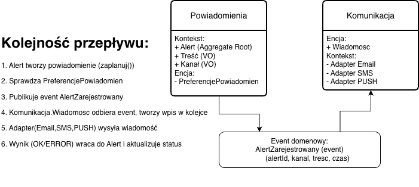

# Zadanie 1 – Domain Driven Design

## **System powiadomień i alertów**

###
Wysyłanie *alertów* o zdarzeniach bankowych do użytkownika różnymi kanałami, takimi jak: e-mail, SMS lub powiadomienie push. 

Wyróżnione zostały dwa *bounded contexts*:
- **Powiadomienia** – tworzenie alertów.
- **Komunikacja** – techniczna wysyłka.

Zastosowano 6 elementów:
- 2 *encje*
- 2 *value objects (VO)*
- 1 *aggregate root*
- 1 *zdarzenie domenowe*

### Kluczowe komponenty
- **Walidacja treści** 
    - sprawdzanie jej długości, poprawności oraz usunięcie niebezpiecznych fragmentów np. HTML, skryptów.
- **Preferencje użytkownika** 
    - określanie, w jaki sposób i kiedy użytkownik chce otrzymywać wiadomości.
- **Śledzenie statusu** 
    - zapisanie, czy wiadomość została wysłana, czy wystąpił błąd i czy próbowano ponownie.

### Diagram DDD

### Założenia i walidacje

| Element | Typ | Kluczowe atrybuty (format) | Walidacje / Reguły |
|---|---|---|---|
| **Alert** | Aggregate Root | `alertId: UUID`, `uzytkownikId: UUID`, `kanal: Kanal`, `tresc: Tresc`, `status: StatusAlertu`, `czasWysylki: ISO-8601` | `zaplanuj()` sprawdza preferencje; status mozna zmienić tylko przez metody domenowe np. `oznaczWysłany()` zeby nikt spoza domeny nie mógł zmienić statusu |
| **PreferencjePowiadomien** | Encja | `uzytkownikId: UUID`, `dozwoloneKanaly: Set<KanalTyp>` | `czyDozwolone(kanal)` zwraca true/false; jeśli false - odrzuć/zaplanuj na później (jeśli występuje preferencja quiet hours) |
| **Tresc** | Value Object | `tytul: 1..120`, `tekst: 1..1000`, `szablonId: string` | Bezpieczeństwo, brak wrazliwych danych np. cały IBAN, usuwanie niebezpiecznych znaczników (`<script>` itp.) |
| **Kanal** | Value Object | `typ: KanalTyp`, `adresDocelowy: string` | EMAIL - RFC 5322; SMS (MSISDN) - E.164; PUSH - token <= 512 znaków |
| **Wiadomosc** | Encja (Komunikacja) | `id: UUID`, `kanal: Kanal`, `tresc: Tresc`, `status: StatusDostarczenia`, `znacznikCzasu: ISO-8601` | Powtórzenie wysłania w razie niepowodzenia; logi błędów i rezultatów |
 
 ### Podsumowanie

Celem jest zapobiec wstrzyknięciu złośliwego kodu np. XSS, HTML injection. 
- Alerty przechodzą czyszczenie przez usuwanie znaczników np. `<script>` dlatego nie zostaną przesłane w powiadomieniu. 
- Jśli schemat jest niepoprawny zostaje odrzucony. 
- Weryfikacja czy ządanie pochodzi z uprawnionego źródła. Walidowanie formatu adresów np. token length. 
- Przed zapisem lub wysłaniem usuwanie są niebezpieczne tagi i atrubuty.
- Nie mozna zmienic statusów w bazie danych bez przejścia przez logikę ze w wględu na metody domenowe.
